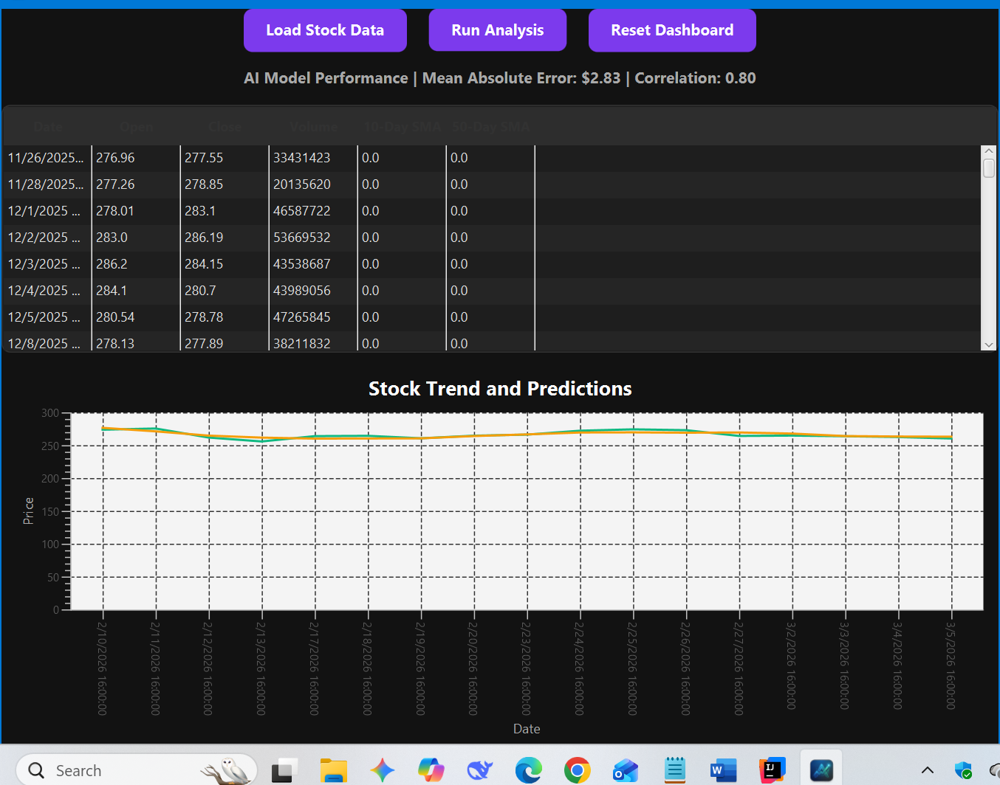

# FinMark Data Analyzer 📈

A full-stack, standalone desktop application built in Java that ingests historical stock market data, engineers financial features, and leverages machine learning to predict future pricing trends.

Designed with a sleek, custom-built JavaFX dark-mode interface, this tool serves as a bridge between raw financial data and actionable, visual analytics.

## 🚀 Key Features

* **Robust Data Ingestion:** Parses historical financial CSV data, automatically handling edge cases like scientific notation and missing fields using Apache Commons.
* **Automated Feature Engineering:** Calculates 10-Day and 50-Day Simple Moving Averages (SMA) on the fly to give the model context regarding market momentum.
* **Machine Learning Engine:** Integrates the Weka Machine Learning library to train a Linear Regression model on the engineered features, outputting Mean Absolute Error (MAE) and Correlation Coefficients.
* **Dynamic Visualization:** Maps both real historical prices and AI-predicted trendlines onto a custom, strictly-typed JavaFX chart in real-time.
* **Executable Deployment:** Packaged as a standalone, native `.exe` wrapper for seamless desktop deployment without requiring terminal execution.

## 🛠️ Tech Stack

* **Language:** Java (JDK 17+)
* **GUI Framework:** JavaFX (with custom CSS styling)
* **Machine Learning:** Weka (Waikato Environment for Knowledge Analysis)
* **Data Parsing:** Apache Commons CSV
* **Build Tool:** Maven / IntelliJ Artifacts
* **Deployment:** Launch4j (.exe wrapper)

## 📸 Dashboard Preview

> 

## ⚙️ How It Works (The Architecture)

1. **The User** loads a standard financial CSV (e.g., Apple stock data exported from Google Finance).
2. **The Controller** sanitizes the data and loops through the historical records to calculate the 10-day and 50-day moving averages.
3. Upon clicking "Run Analysis," **The Weka AI** isolates the target variable (`Close` price) and trains a regression model using the newly calculated SMAs.
4. **The UI Thread** (`Platform.runLater`) takes over to safely render hundreds of data points, drawing the AI's predicted trendline against the actual market data without freezing the application.

## 💻 Getting Started (Local Development)

To run this project locally and experiment with the code:

1. Clone the repository:
   ```bash
   git clone [https://github.com/retr-grimmripper/finmark-data-analyzer.git](https://github.com/retr-grimmripper/finmark-data-analyzer.git)